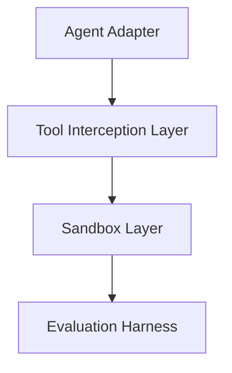
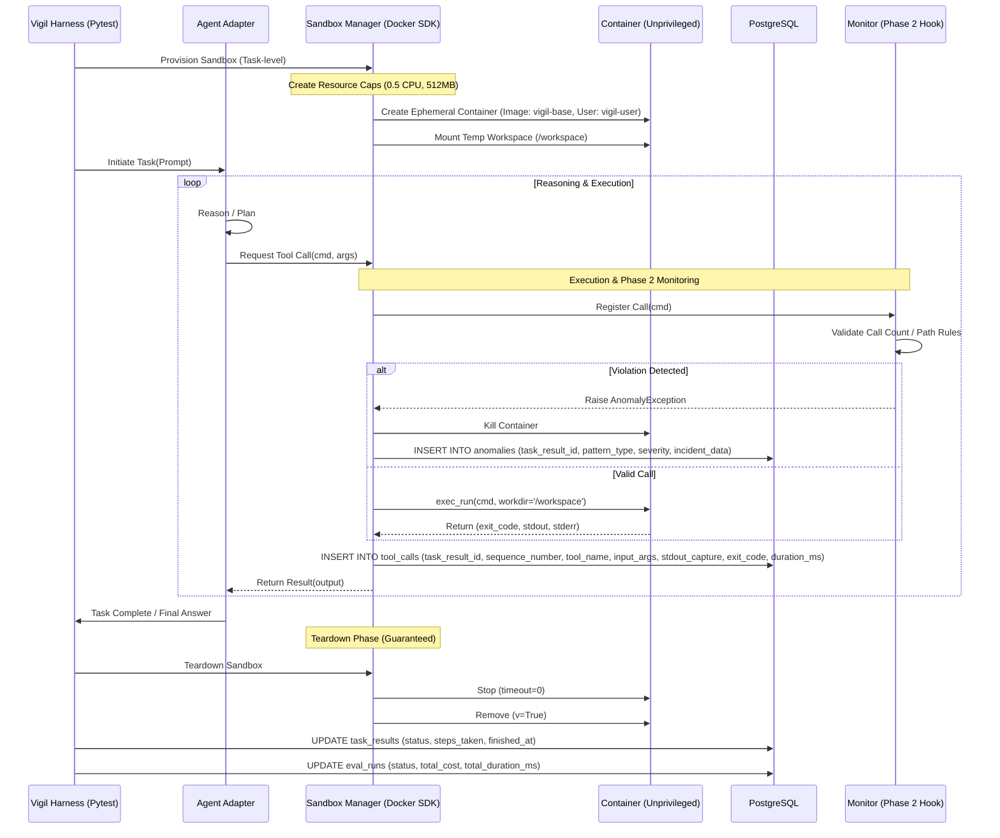

# System Architecture: Vigil Sandbox & Evaluation Lifecycle

This document defines the end-to-end execution flow of the **Vigil** sandbox environment. It details how agent tool-calls are intercepted, isolated within Docker, and recorded for deterministic evaluation.

---

## 1. Architectural Boundaries and Component Layers

Vigil enforces a strict separation of concerns across its execution stack:



*   **Agent Adapter:** Translates agent-specific orchestrations into a standard format. **LangGraph** is implemented as the first agent adapter, enabling it to interact with Vigil's tools. Importantly, LangGraph is NOT embedded into the core engine; it is treated as a pluggable adapter.
*   **Tool Interception Layer:** Intercepts agent tool requests, checks them against monitoring/anomaly rules, and routes them to the Sandbox.
*   **Sandbox Layer:** Manages container provisioning, execution, and cleanup using the Docker SDK.
*   **Evaluation Harness:** Runs tasks, gathers container state, performs assertions, and logs results to PostgreSQL.

---

## 2. Trust Boundaries

To ensure the safety and integrity of the host system during evaluation:
*   **Vigil Harness (Trusted Infrastructure):** The harness runs on the host, has direct access to the Docker socket (`docker.sock`), host secrets, and the PostgreSQL database. It is trusted and must be protected from agent injection.
*   **Agent under Evaluation (Untrusted):** The agent code, prompts, and tools run inside the unprivileged ephemeral Docker container. The agent is strictly untrusted.
*   **No Privilege Leakage:** Under no circumstances should the agent container receive:
    *   Access to the host's Docker socket (`docker.sock`).
    *   Host environment variables or secrets.
    *   Mounts to host filesystem paths outside of the designated temporary `/workspace` directory.

---

## 3. Isolation vs. Monitoring Layers

Vigil splits runtime security and logging into two distinct conceptual layers:

*   **Isolation Layer (Docker-managed):** Responsible for enforcing physical runtime limits. Its job is to **prevent and constrain** behavior:
    *   **Non-root execution:** Runs processes as `vigil-user` (UID 1000).
    *   **Resource limits:** Caps memory (512MB) and CPU (0.5 cores).
    *   **Network:** Blocks or allows network traffic via container configuration.
    *   **Filesystem:** Enforces read-only root with only `/workspace` writable.
    *   **Lifecycle & Cleanup:** Handles container startup, execution, and teardown.
*   **Monitoring Layer (Vigil-managed):** Responsible for observing the execution and capturing telemetry. Its job is to **observe, classify, and record** behavior:
    *   **Tool-call limits:** Restricts total execution steps.
    *   **Repeated-pattern detection:** Tracks looping behavior.
    *   **Path violations:** Intercepts blocked write attempts outside `/workspace` to raise and log anomalies.
    *   **Process anomalies:** Flags spawning of forbidden subprocesses.
    *   **Anomaly logging:** Persists warnings and critical violations to the database (`anomalies` table).

---

## 4. Sandbox Execution Sequence

The following diagram illustrates the lifecycle of a single evaluation task, from the Pytest trigger to the final teardown and persistence.



---

## 5. Detailed Lifecycle Stages

### 5.1 Trigger & Orchestration
The run is initiated by the `VigilRunner` (a custom Pytest wrapper). It passes the task context to the pluggable **Agent Adapter** (e.g., LangGraph). When the agent under evaluation hits a node requiring external action, it does not execute locally. Instead, it invokes the standard `VigilSandboxTool` interface, which delegates to the Sandbox Layer. LangGraph is treated as the first adapter implementation and is kept separate from the core evaluation engine.

### 5.2 Provisioning (The "Tight Box")
The `SandboxManager` uses the Docker SDK to provision one ephemeral container per evaluation task, supporting multiple sequential tool calls within that container, destroyed after task completion/failure/timeout. The container is configured with the following strict constraints:
*   **User:** `vigil-user` (UID 1000), strictly non-root.
*   **Networking:** `network_mode="none"` by default (toggleable per task).
*   **Security Ops:** `--cap-drop=ALL`, `--security-opt=no-new-privileges`.
*   **Resource Limits:** `mem_limit="512m"`, `nano_cpus=500000000` (0.5 cores).
*   **Storage:** A temporary host directory is mounted to `/workspace`. This is the *only* writable path.

### 5.3 Execution & Capture
Vigil uses `container.exec_run()` rather than running commands as the container's PID 1. The container lifecycle is managed as one ephemeral container per evaluation task, supporting multiple sequential tool calls within that container, destroyed after task completion/failure/timeout. This preserves `/workspace` state across calls while ensuring each specific command is isolated.
*   **Capture:** `stdout` and `stderr` are merged or separated based on the task config.
*   **Timeouts:** Each `exec_run` has a sub-timeout (e.g., 30s). If exceeded, the harness issues a `docker kill`.

### 5.4 Teardown (The Cleanup Hierarchy)
To prevent "zombie containers" from saturating the host, Vigil implements a multi-tiered cleanup hierarchy:
1.  **Primary: `try/finally` block** — Owns the **Normal Completion** and **Execution Timeout** scenarios. The container is created, used, and explicitly stopped and removed in a `finally` block of the task execution wrapper.
2.  **Secondary: Signal Handlers + Active-Container Registry** — Owns the **Process Interruption** scenario. During startup, the harness registers signal handlers (`SIGINT`, `SIGTERM`) and tracks active container IDs in an in-memory `ActiveContainerRegistry`. If the process is interrupted, the signal handlers iterate through the registry and force immediate deletion of all active containers.
3.  **Last-Resort: Supervisor-Based Stale-Container Sweep** — Owns the **Orphaned Container** scenario. A background daemon process (`VigilSupervisor`) runs every 5 minutes to scan the host Docker daemon. Any container with the label `vigil-sandbox` that has been running longer than 10 minutes is forcefully pruned.

---

## 6. Failure Mode Handling

| Failure Scenario | Mitigation Strategy | Resulting State |
| :--- | :--- | :--- |
| **Agent Infinite Loop** | Phase 2 `LoopTracker` triggers at N calls. | Task marked `FAILED (Loop detected)` in `task_results.status`. Container killed. |
| **Container OOM** | Docker Daemon kills process; SDK returns exit code `137`. | Logged as `ERROR` in `task_results.status`. DB records memory limit hit. |
| **DB Connection Lost** | Local fallback to `.jsonl` log file in `temp_run/` directory. | Run finishes; logs synced to DB once reconnected. |
| **Zombie Container** | `VigilSupervisor` cron runs every 5 mins to prune containers with `label=vigil-sandbox` older than 10 mins. | Host resources reclaimed automatically. |

---

## 7. Phase Hook Points

### 7.1 Phase 2: Anomaly Detection Hook
The **Tool Execution Loop Tracker** plugs in at the `Execution` stage.
*   **Count-based:** The `Monitor` queries the current run's in-memory tool-count.
*   **Pattern-based:** Before `exec_run`, the command string is regex-checked for blocked patterns (e.g., `rm -rf /`, `chown`).
*   **Filesystem-based:** Vigil uses container-level read-only root filesystems so that any write attempts outside `/workspace` are blocked at the container level by Docker (container-level denial). In addition, the pre-execution path validation layer intercepts and logs these attempts as `PATH` anomalies in the `anomalies` table for audit visibility (enforcement + logged detection).

### 7.2 Phase 3: Metrics & Dashboard Hook
The **Persistence Layer** facilitates the dashboard.
*   **Log Schema:**
    ```sql
    CREATE TABLE tool_calls (
        id UUID PRIMARY KEY,
        task_result_id UUID REFERENCES task_results(id),
        sequence_number INTEGER,
        tool_name VARCHAR(255),
        input_args JSONB,
        stdout_capture TEXT,
        exit_code INTEGER,
        duration_ms INTEGER,
        created_at TIMESTAMP
    );
    ```
*   **Aggregation:** FastAPI queries this table to generate the **Performance Metrics Matrix** (P90 latency per tool, cost-per-pass, etc.).

---

## 8. Persistence Strategy

Vigil prioritizes **logging durability**.
1.  **Pre-log:** When a task run is *initiated*, a record is created in `eval_runs` with `status='PENDING'` and a corresponding `task_results` entry.
2.  **Post-log:** When each tool call completes, a record is added to `tool_calls` with the `sequence_number`, duration, and stdout/stderr capture.
3.  **Outcome:** The final `PASS`/`FAIL`/`ERROR` status from the Pytest assertion is written to `task_results.status`, and the overall `eval_runs.status` is updated to `COMPLETED` or `FAILED`. This ensures that even if an execution crashes midway, the database retains the records of all completed tool calls.