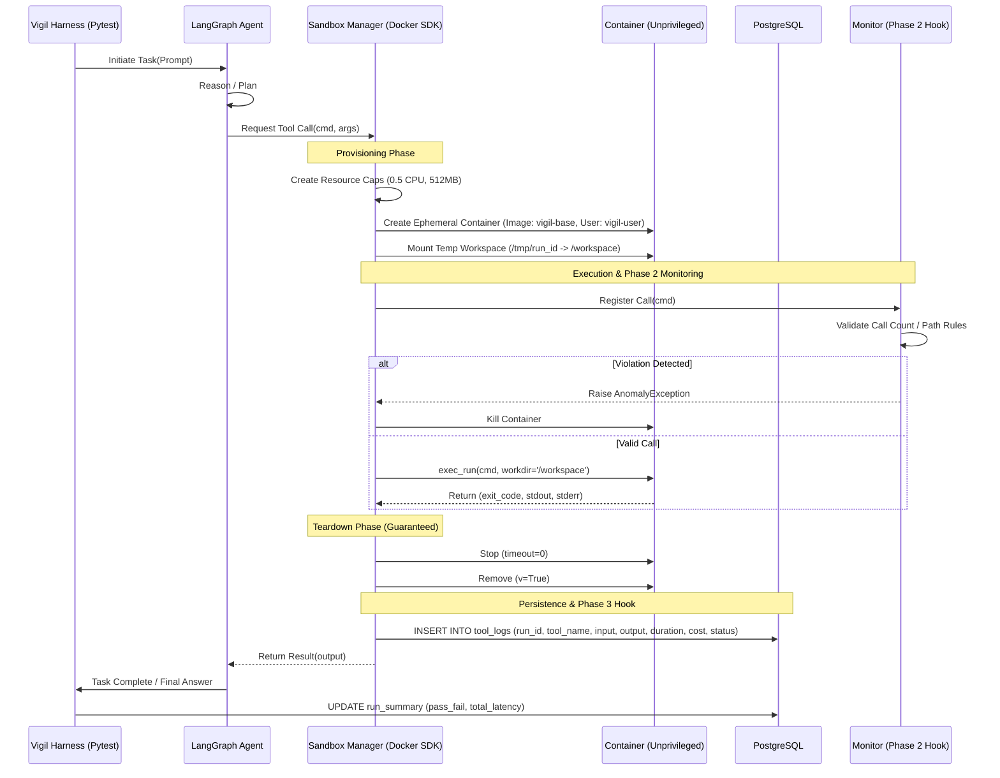

# System Architecture: Vigil Sandbox & Evaluation Lifecycle

This document defines the end-to-end execution flow of the **Vigil** sandbox environment. It details how agent tool-calls are intercepted, isolated within Docker, and recorded for deterministic evaluation.

---

## 1. Sandbox Execution Sequence

The following diagram illustrates the lifecycle of a single evaluation task, from the Pytest trigger to the final teardown and persistence.



---

## 2. Detailed Lifecycle Stages

### 2.1 Trigger & Orchestration
The run is initiated by the `VigilRunner` (a custom Pytest wrapper). It passes the task context to the **LangGraph Agent**. When the agent hits a node requiring external action (e.g., "Run this Python script"), it does not execute locally. Instead, it invokes the `VigilSandboxTool`.

### 2.2 Provisioning (The "Tight Box")
The `SandboxManager` uses the Docker SDK to provision a container with the following strict constraints:
*   **User:** `vigil-user` (UID 1000), strictly non-root.
*   **Networking:** `network_mode="none"` by default (toggleable per task).
*   **Security Ops:** `--cap-drop=ALL`, `--security-opt=no-new-privileges`.
*   **Resource Limits:** `mem_limit="512m"`, `nano_cpus=500000000` (0.5 cores).
*   **Storage:** A temporary host directory is mounted to `/workspace`. This is the *only* writable path.

### 2.3 Execution & Capture
Vigil uses `container.exec_run()` rather than running commands as the container's PID 1. This allows the sandbox to stay alive for multiple sequential tool calls within a single task (preserving `/workspace` state) while ensuring each specific command is isolated.
*   **Capture:** `stdout` and `stderr` are merged or separated based on the task config.
*   **Timeouts:** Each `exec_run` has a sub-timeout (e.g., 30s). If exceeded, the harness issues a `docker kill`.

### 2.4 Teardown (The "Guaranteed Cleanup" Path)
To prevent "zombie containers" from saturating the host, the `SandboxManager` implements a `ContextManager` pattern:
1.  **Happy Path:** Container stops and removes after the tool call returns.
2.  **Harness Crash:** On SIGINT/SIGTERM to the Python process, a global `CleanupRegistry` iterates through all active `container_ids` and issues forced removals.
3.  **Timeout/Hang:** If a tool hangs, the `finally` block of the execution wrapper ensures `container.remove(force=True)` is called.

---

## 3. Failure Mode Handling

| Failure Scenario | Mitigation Strategy | Resulting State |
| :--- | :--- | :--- |
| **Agent Infinite Loop** | Phase 2 `LoopTracker` triggers at N calls. | Task marked `FAILED (Loop detected)`. Container killed. |
| **Container OOM** | Docker Daemon kills process; SDK returns exit code `137`. | Logged as `CRASHED`. DB records memory limit hit. |
| **DB Connection Lost** | Local fallback to `.jsonl` log file in `temp_run/` directory. | Run finishes; logs synced to DB once reconnected. |
| **Zombie Container** | `VigilSupervisor` cron runs every 5 mins to prune containers with `label=vigil-sandbox` older than 10 mins. | Host resources reclaimed automatically. |

---

## 4. Phase Hook Points

### 4.1 Phase 2: Anomaly Detection Hook
The **Tool Execution Loop Tracker** plugs in at the `Execution` stage.
*   **Count-based:** The `Monitor` queries the current run's in-memory tool-count.
*   **Pattern-based:** Before `exec_run`, the command string is regex-checked for blocked patterns (e.g., `rm -rf /`, `chown`).
*   **Filesystem-based:** After execution, the monitor checks if the agent attempted to create files outside `/workspace` (via `find / -not -path "/workspace/*"`).

### 4.2 Phase 3: Metrics & Dashboard Hook
The **Persistence Layer** facilitates the dashboard.
*   **Log Schema:**
    ```sql
    CREATE TABLE tool_executions (
        id UUID PRIMARY KEY,
        run_id UUID REFERENCES eval_runs(id),
        tool_name VARCHAR(255),
        input_payload JSONB,    -- Arguments sent to tool
        output_payload TEXT,    -- Stdout/Stderr
        exit_code INTEGER,
        duration_ms INTEGER,    -- Latency
        token_cost NUMERIC,     -- Estimated cost of the prompt leading to this call
        created_at TIMESTAMP
    );
    ```
*   **Aggregation:** FastAPI queries this table to generate the **Performance Metrics Matrix** (P90 latency per tool, cost-per-pass, etc.).

---

## 5. Persistence Strategy

Vigil prioritizes **logging durability**.
1.  **Pre-log:** When a tool call is *initiated*, a record is created in PostgreSQL with `status=PENDING`.
2.  **Post-log:** Once the container returns or fails, the record is updated with the result and duration.
3.  **Outcome:** The final `pass/fail` from the Pytest assertion is the last write, closing the run. This ensures that even if an agent crashes midway, we have the breadcrumbs of what it attempted.