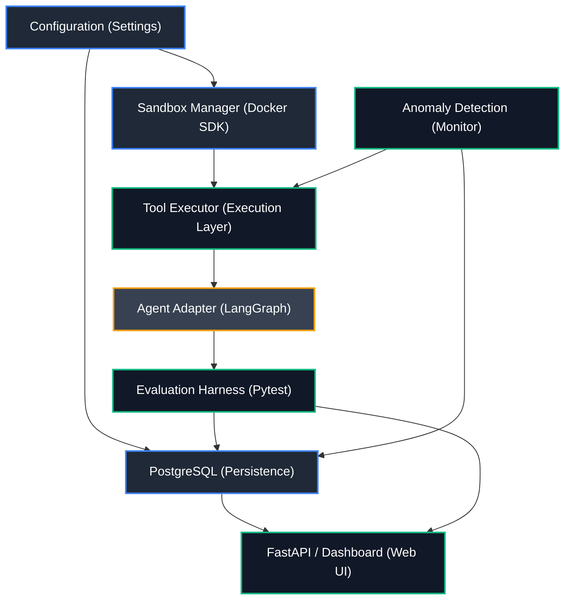
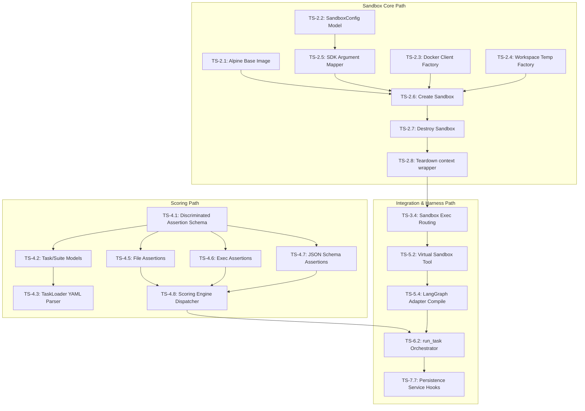

# Vigil: Architecture-to-Implementation Dependency Graph

This document details the sequential relationships and dependency trees governing Vigil's modules and task implementation order. The project strictly prioritizes the shortest dependency chain over parallel development to optimize sequential implementation for a single developer.

---

## 1. Module-Level Dependency Graph

This diagram illustrates how the core layers of Vigil depend on one another. The trusted configuration, DB, and sandbox layers form the baseline, upon which execution logic, agent adapters, and evaluation harnesses are built.

---

## 2. Phase-by-Phase Development Order

The sequential roadmap of phases is designed as a linear path with feedback gates. Every milestone leaves the codebase in a runnable and testable state.

```mermaid
graph LR
    P1["P01: Project Setup"] --> P2["P02: Sandbox Core"]
    P2 --> P3["P03: Tool Execution"]
    P3 --> P4["P04: Eval Definitions"]
    P4 --> P5["P05: Agent Adapter"]
    P5 --> P6["P06: Pytest Harness"]
    P6 --> P7["P07: DB Persistence"]
    P7 --> P8["P08: MVP Verification"]
    P8 --> P9["P09: Manual Dev Guide"]
    P9 --> P10["P10: Anomaly Detection"]
    P10 --> P11["P11: Metrics Math"]
    P11 --> P12["P12: API & UI"]
    P12 --> P13["P13: Portfolio Gate"]
```

---

## 3. Detailed Component Task Dependencies

Below is the atomic task dependency mapping for critical engineering paths. Implement tasks in order of their prerequisite layers.

---

## 4. Cross-Module Interface Summary

1. **`core` to `eval`**: The `EvalRunner` requires `SandboxManager` to spin up environments, mount temporary directories, and clean up post-execution states.
2. **`agents` to `core`**: The agent adapter registers `VigilSandboxTool` which forwards payload requests to the `ToolExecutor` running inside the active task container.
3. **`db` to `eval` / `api`**: The `PersistenceService` hooks write runs, results, and anomalies directly to tables, which the FastAPI `MetricsEngine` later aggregates.
