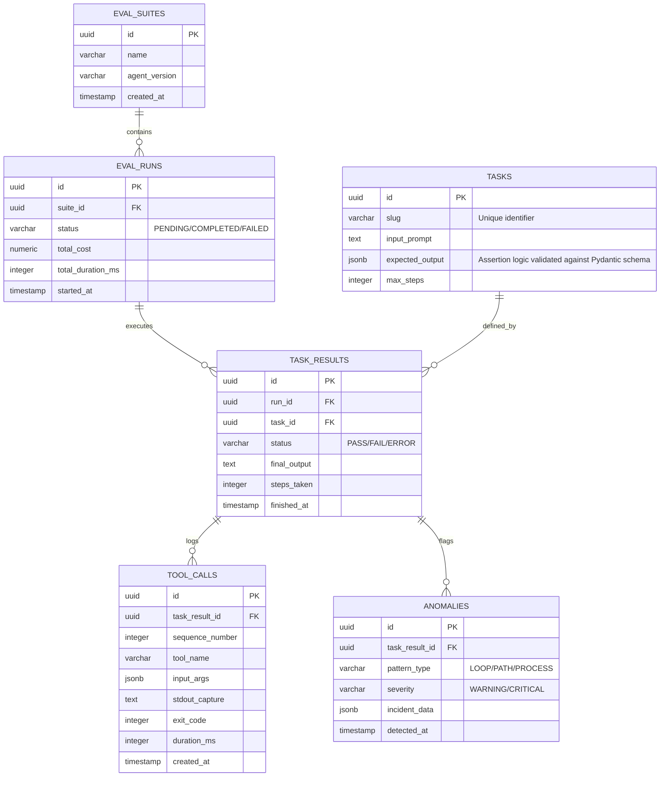

# Database Schema: Vigil (v1.0.0)

Vigil utilizes **PostgreSQL 16** for high-durability logging of agent executions, sandbox state transitions, and evaluation outcomes. The schema is designed to support Phase 1 (Deterministic Evals), Phase 2 (Anomaly Tracking), and Phase 3 (Metric Aggregation).

---

## 1. Relational Entity Diagram

---

## 2. Table Dictionary

### 1. `eval_suites`
Groups multiple evaluation runs for regression testing.
*   **Purpose:** Tracks a logical set of tests against a specific agent version or system prompt.
*   **Fields:**
    *   `id` (UUID, PK): Unique identifier for the suite.
    *   `name` (VARCHAR): Descriptive name of the suite.
    *   `agent_version` (VARCHAR): Git commit hash or semantic version of the agent under test.
    *   `created_at` (TIMESTAMP): Time the suite was registered.

### 2. `tasks`
The immutable definition of an evaluation scenario.
*   **Purpose:** Stores the "Gold Standard" prompt and the deterministic assertions required to pass.
*   **Fields:**
    *   `id` (UUID, PK): Unique identifier.
    *   `slug` (VARCHAR): Unique slug/identifier for easy command-line references.
    *   `input_prompt` (TEXT): The prompt text sent to the agent.
    *   `expected_output` (JSONB): The assertion logic, validated against the Pydantic Discriminated Model defined in the Evaluation Harness Spec.
    *   `max_steps` (INTEGER): Maximum allowed tool calls before failing.

### 3. `eval_runs`
An instance of a suite execution.
*   **Purpose:** High-level summary of a complete regression run.
*   **Fields:**
    *   `id` (UUID, PK): Unique run identifier.
    *   `suite_id` (UUID, FK): References `eval_suites(id)`.
    *   `status` (VARCHAR): Lifecycle status. Allowed values: `PENDING`, `COMPLETED`, `FAILED`.
    *   `total_cost` (NUMERIC): Aggregated monetary cost based on tokens used.
    *   `total_duration_ms` (INTEGER): Total execution latency for the run.
    *   `started_at` (TIMESTAMP): Starting timestamp.

### 4. `task_results`
The outcome of a specific task within a run.
*   **Purpose:** Records whether an agent successfully solved a specific prompt.
*   **Fields:**
    *   `id` (UUID, PK): Unique result identifier.
    *   `run_id` (UUID, FK): References `eval_runs(id)`.
    *   `task_id` (UUID, FK): References `tasks(id)`.
    *   `status` (VARCHAR): Assertion scoring outcome. Allowed values: `PASS`, `FAIL`, `ERROR`.
    *   `final_output` (TEXT): The agent's final text response.
    *   `steps_taken` (INTEGER): Total number of tool calls executed for the task.
    *   `finished_at` (TIMESTAMP): Time the task completed.

### 5. `tool_calls`
Granular logs of every interaction with the Docker SDK.
*   **Purpose:** The core audit trail for Phase 1. Records exactly what the agent did inside the sandbox.
*   **Fields:**
    *   `id` (UUID, PK): Unique execution identifier.
    *   `task_result_id` (UUID, FK): References `task_results(id)`.
    *   `sequence_number` (INTEGER): 1-indexed ordering of tool executions within a task run.
    *   `tool_name` (VARCHAR): The name of the tool called (e.g., `python_exec`).
    *   `input_args` (JSONB): The raw arguments/code sent to the tool.
    *   `stdout_capture` (TEXT): Combined stdout and stderr outputs.
    *   `exit_code` (INTEGER): Process exit code from the sandbox.
    *   `duration_ms` (INTEGER): Latency of the tool call execution.
    *   `created_at` (TIMESTAMP): Execution timestamp.

### 6. `anomalies`
Log of flagged patterns from the Phase 2 Execution Loop Tracker.
*   **Purpose:** Captures security-relevant events that violated the safety scope.
*   **Fields:**
    *   `id` (UUID, PK): Unique anomaly identifier.
    *   `task_result_id` (UUID, FK): References `task_results(id)`.
    *   `pattern_type` (VARCHAR): The type of violation. Allowed values: `LOOP`, `PATH`, `PROCESS`.
    *   `severity` (VARCHAR): Violation impact level. Allowed values: `WARNING`, `CRITICAL`.
    *   `incident_data` (JSONB): Structured details of the anomaly (e.g., the blocked command or filesystem target).
    *   `detected_at` (TIMESTAMP): Time the anomaly was flagged.

---

## 3. Engineering Justification

### JSONB for Assertions & Tool Input
Vigil uses `JSONB` for `tasks.expected_output` and `tool_calls.input_args`. This allows the harness to store diverse tool parameters (e.g., a Python script string vs. a SQL query object) without schema migrations, while still allowing PostgreSQL to index and query specific keys for Phase 3 analytics.

### Atomic Task Results
By separating `eval_runs` from `task_results`, Vigil ensures that if a harness crashes midway through a 50-task suite, the first 25 results remain committed and queryable.

### Audit Integrity
The `ANOMALIES` table is explicitly linked to `task_results` but populated independently by the `SandboxMonitor`. This ensures that even if an agent's reasoning loop fails to return a final answer, the record of the "Anomaly" that caused the kill-signal is preserved for engineering review.