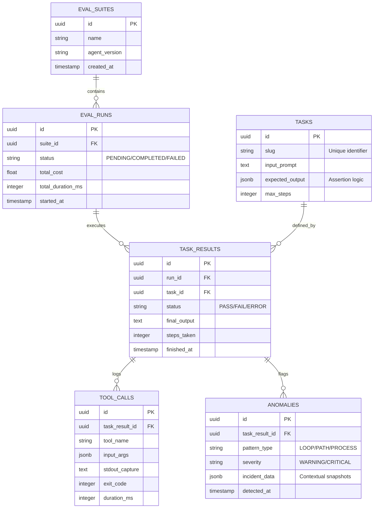

# Database Schema: Vigil (v1.0.0)

Vigil utilizes **PostgreSQL 16** for high-durability logging of agent executions, sandbox state transitions, and evaluation outcomes. The schema is designed to support Phase 1 (Deterministic Evals), Phase 2 (Anomaly Tracking), and Phase 3 (Metric Aggregation).

---

## 1. Relational Entity Diagram

---

## 2. Table Dictionary

### 1. `eval_suites`
Groups multiple evaluation runs for regression testing.
*   **Purpose:** Tracks a logical set of tests against a specific agent version or system prompt.
*   **Key Fields:** `id`, `name`, `agent_version` (Git hash or semantic version).

### 2. `tasks`
The immutable definition of an evaluation scenario.
*   **Purpose:** Stores the "Gold Standard" prompt and the deterministic assertions required to pass.
*   **Key Fields:** `input_prompt`, `expected_output` (JSONB containing assertion types like `file_exists` or `content_match`), `max_steps`.

### 3. `eval_runs`
An instance of a suite execution.
*   **Purpose:** High-level summary of a complete regression run.
*   **Key Fields:** `status`, `total_cost` (calculated from token usage), `total_duration_ms`.

### 4. `task_results`
The outcome of a specific task within a run.
*   **Purpose:** Records whether an agent successfully solved a specific prompt.
*   **Key Fields:** `status` (PASS/FAIL/ERROR), `steps_taken` (number of tool calls used), `final_output` (the agent's text response).

### 5. `tool_calls`
Granular logs of every interaction with the Docker SDK.
*   **Purpose:** The core audit trail for Phase 1. Records exactly what the agent did inside the sandbox.
*   **Key Fields:** `tool_name` (e.g., `python_exec`), `input_args` (code executed), `stdout_capture`, `exit_code`, `duration_ms`.

### 6. `anomalies`
Log of flagged patterns from the Phase 2 Execution Loop Tracker.
*   **Purpose:** Captures security-relevant events that violated the safety scope.
*   **Key Fields:** `pattern_type` (LOOP, PATH_VIOLATION, or PROCESS_SPAWN), `incident_data` (e.g., the specific blocked path the agent attempted to write to).

---

## 3. Engineering Justification

### JSONB for Assertions & Tool Input
Vigil uses `JSONB` for `tasks.expected_output` and `tool_calls.input_args`. This allows the harness to store diverse tool parameters (e.g., a Python script string vs. a SQL query object) without schema migrations, while still allowing PostgreSQL to index and query specific keys for Phase 3 analytics.

### Atomic Task Results
By separating `eval_runs` from `task_results`, Vigil ensures that if a harness crashes midway through a 50-task suite, the first 25 results remain committed and queryable.

### Audit Integrity
The `ANOMALIES` table is explicitly linked to `task_results` but populated independently by the `SandboxMonitor`. This ensures that even if an agent's reasoning loop fails to return a final answer, the record of the "Anomaly" that caused the kill-signal is preserved for engineering review.